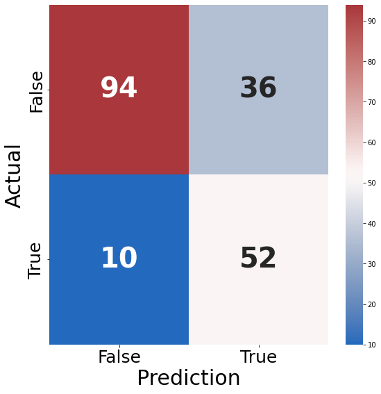
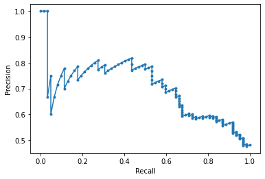

# A Diabetes Classifier
link to dataset: [diabetes dataset](https://www.kaggle.com/mathchi/diabetes-data-set)

Goal: The goal of this project is to develop a good conservative diabetes classifier. Conservative here is in the sense that we'd like
to have a maximize recall. Good is in the sense that we still want our classifier to have
reasonable accuracy.

The project is organized as follows:


1. EDA, Understanding the Data
- Clean Data
- Impute Missing Data
- Data Visualization
- Selecting Features
- Ideas for Introduction of Features
2. Model Building Idea, Functions for Visualization
- Conservative model building philosophy
- Testing and visualizing different models, including:
3. Model Building and Feature Experimentation
- Many models tested with all data scaled. Classifiers included are
    * Dummy classifier, for comparison.
    * Gradient Boosting Classifier
    * Logistic Regression
    * Support Vector Machine
    * Random Forest
    * K Nearest Neighbors
    * Decision Tree Classifier
- One-Hot Encoding on age, then on age and BMI, then just om BMI with gradient boosting classifiers and logistic regression tested.

# Summary
- Out of the models that are tested, the following produced reasonable results: Gradient Boosting, Logistic Regression, and Random Forest. It appears that the one-hot encoding does provide minor improvement for gradient boosting classification, but not for logistic regression. The following is a summary of the models (all with numerical data) on the test set (with a random state of 0):


- Gradient Boosting:
    * All data numerical:
        * Recall: 63%
        * Accuracy: 77%
    * One-Hot on just Age
        * Recall: 73%
        * Accuracy: 80%
    * One-Hot on Age, BMI
        * Recall: 61%
        * Accuracy: 77%
    * One-Hot on just BMI
        * Recall: 65%
        * Accuracy: 77%


- Logistic Regression:
    * All data numerical:
        * Recall: 81%
        * Accuracy: 76%
    * One-Hot on just Age
        * Recall: 81%
        * Accuracy: 78%
    * One-Hot on Age, BMI
        * Recall: 79%
        * Accuracy: 79%
    * One-Hot on just BMI
        * Recall: 81%
        * Accuracy: 76%

- Random Forest:
    * Recall: 69%
    * Accuarcy: 80%

# Deployment
Logistic Regression model is deployed as a flask application on Heroku. Feel free to check it out [here](https://diabetes-ml-classifier-jc.herokuapp.com/).

# Shortened Notebook

## Summary of Gradient Boosting Model

Below you'll find a summary of the gradient boosting model including precision, recall information and a confusion  matrix.

```python
summary_of_model(grid_clf_boost, X_train, X_test, y_train, y_test, thresh)
```

                  precision    recall  f1-score   support

               0       0.87      0.84      0.85       130
               1       0.69      0.74      0.71        62

        accuracy                           0.81       192
       macro avg       0.78      0.79      0.78       192
    weighted avg       0.81      0.81      0.81       192

    Recall of diabetes on the training set: 0.81
    Accuracy on the training set: 0.80
    Recall of diabetes class on the test set: 0.74
    Accuracy on the test set: 0.81
    [[109  21]
     [ 16  46]]


## Summary of Logistic Regression

Below you'll find a summary of the logistic regression model including precision, recall information and a confusion matrix.

```python
summary_of_model(grid_clf_log, X_train, X_test, y_train, y_test, thresh)
```

                  precision    recall  f1-score   support

               0       0.90      0.72      0.80       130
               1       0.59      0.84      0.69        62

        accuracy                           0.76       192
       macro avg       0.75      0.78      0.75       192
    weighted avg       0.80      0.76      0.77       192

    Recall of diabetes on the training set: 0.81
    Accuracy on the training set: 0.73
    Recall of diabetes class on the test set: 0.84
    Accuracy on the test set: 0.76
    [[94 36]
     [10 52]]






